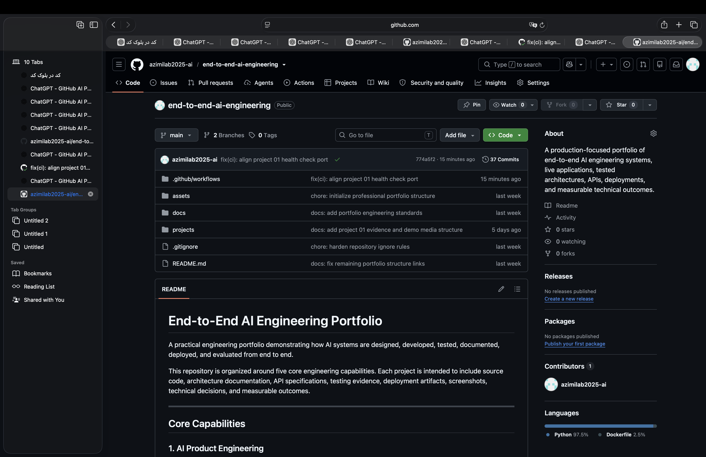
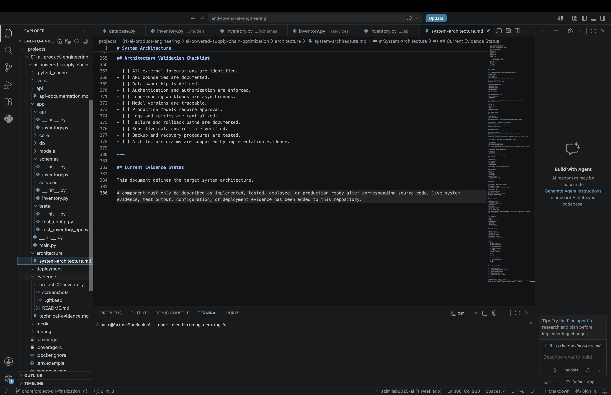
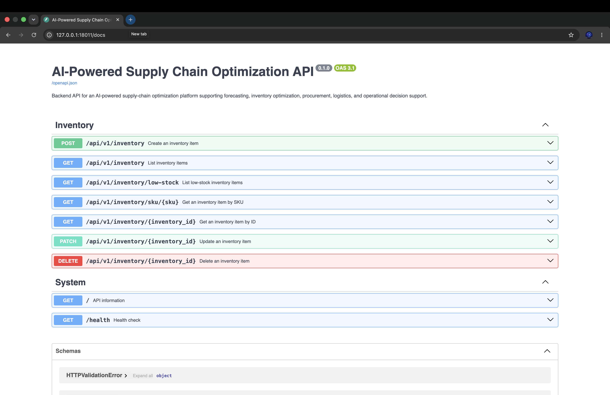
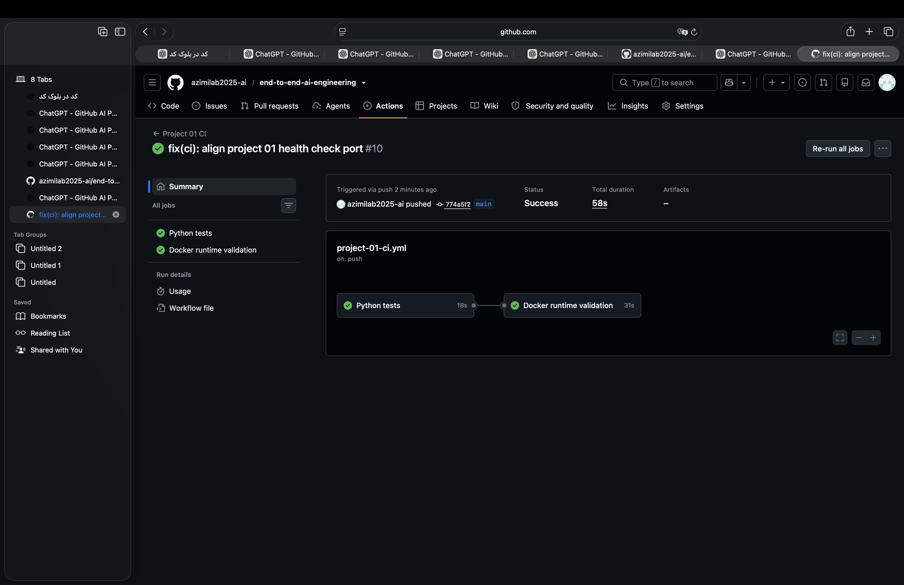

# AI-Powered Supply Chain Optimization Platform

## Executive Summary

An enterprise-grade AI platform designed to optimize supply chain operations using machine learning, predictive analytics, and intelligent decision support.

The platform continuously analyzes operational data to improve inventory planning, demand forecasting, logistics efficiency, and procurement strategies.

---

## Technical Evidence Gallery

### 1. Repository Structure

### 2. Architecture and Code

### 3. Swagger API Validation

### 4. GitHub Actions CI

---

## Business Problem

Large organizations lose significant revenue due to inaccurate forecasting, inventory imbalance, delayed logistics, and inefficient supplier management.

Traditional ERP systems provide historical reporting but lack predictive intelligence and autonomous optimization.

---

## Solution

The platform integrates AI models with operational systems to provide:

- Demand Forecasting
- Inventory Optimization
- Supplier Risk Analysis
- Logistics Optimization
- Intelligent Procurement Recommendations
- Real-time Operational Monitoring

---

## Business Value

- Reduced inventory costs
- Increased forecast accuracy
- Faster operational decision making
- Lower logistics expenses
- Higher customer satisfaction
- Improved supply chain resilience

---

## Technology Stack

- Python
- FastAPI
- PostgreSQL
- Docker
- Kubernetes
- Redis
- Celery
- OpenAI API
- LangChain
- Vector Database
- React
- TypeScript

---

## Project Status

Architecture Design

Engineering Documentation

API Specification

Testing Strategy

Deployment Strategy

Evidence Collection

Production Ready