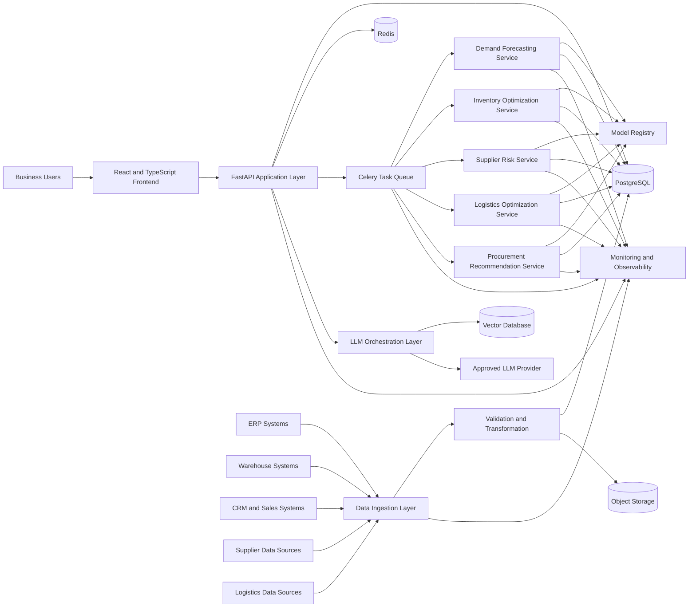
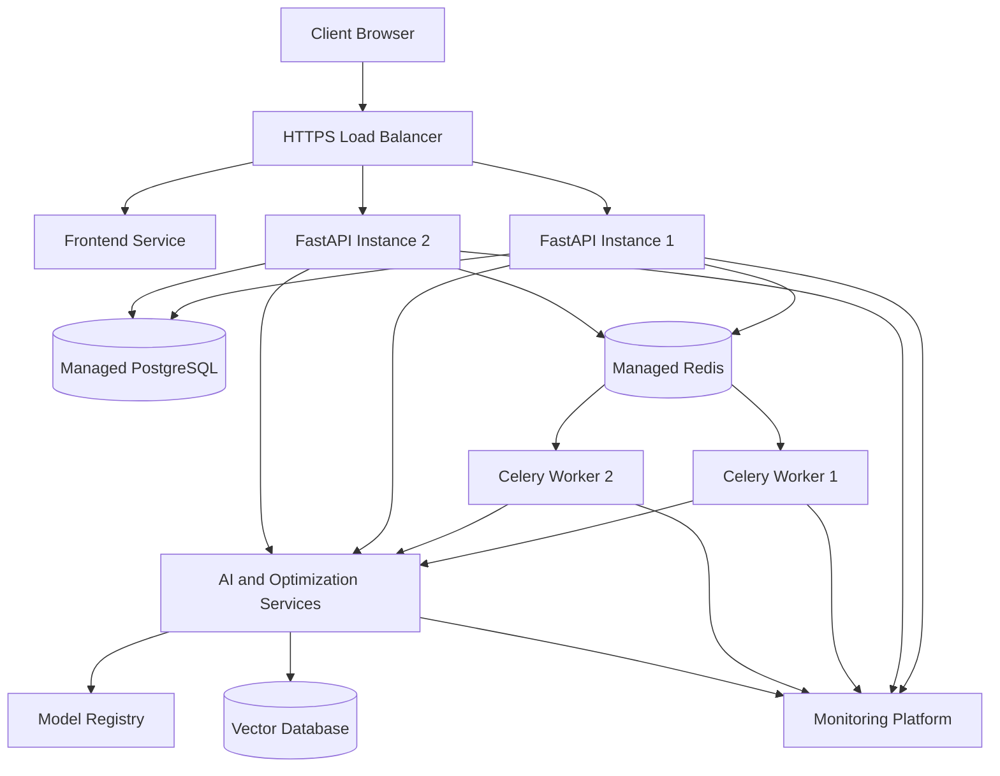

# System Architecture

## Architecture Objective

This document defines the target architecture for the AI-Powered Supply Chain Optimization Platform.

The architecture is designed to support:

- Demand forecasting
- Inventory optimization
- Supplier-risk analysis
- Logistics optimization
- Procurement recommendations
- Operational monitoring
- Secure API integration
- Scalable model execution
- Production observability

---

## Architecture Principles

1. Modular service boundaries
2. API-first integration
3. Independent model lifecycle management
4. Asynchronous processing for long-running workloads
5. Reproducible deployment
6. End-to-end observability
7. Secure handling of operational data
8. Evidence-based performance validation
9. Graceful failure and recovery
10. Separation of transactional and analytical workloads

---

## High-Level Architecture

---

## Core Components

### 1. User Interface

The frontend provides operational dashboards and decision-support workflows for:

- Supply-chain managers
- Inventory planners
- Procurement teams
- Logistics teams
- Business analysts
- System administrators

The interface communicates with the backend through authenticated APIs.

### 2. API and Application Layer

FastAPI provides the primary service interface.

Responsibilities include:

- Authentication and authorization
- Request validation
- Business workflow orchestration
- Model-execution requests
- Recommendation retrieval
- Forecast retrieval
- Operational status reporting
- Audit-event generation
- Error handling

### 3. Data Ingestion Layer

The ingestion layer receives structured operational data from internal and external systems.

Supported integration patterns include:

- REST APIs
- Scheduled file ingestion
- Database connectors
- Event-driven ingestion
- Batch imports

All incoming data must pass schema, completeness, range, and consistency checks before downstream use.

### 4. Transactional Data Store

PostgreSQL stores:

- Users and roles
- Products
- Suppliers
- Inventory records
- Orders
- Forecasts
- Recommendations
- Model-execution metadata
- Audit events
- Deployment metadata

### 5. Cache and Task Queue

Redis supports:

- Response caching
- Session-related data
- Rate-limit counters
- Celery message transport
- Temporary task state

Celery executes long-running or compute-intensive operations outside synchronous API requests.

### 6. AI and Optimization Services

The platform separates AI responsibilities into domain services:

#### Demand Forecasting Service

Produces demand estimates across defined products, locations, and time horizons.

#### Inventory Optimization Service

Calculates recommended inventory levels, reorder points, and safety-stock targets.

#### Supplier Risk Service

Evaluates supplier reliability using delivery, quality, financial, and operational indicators.

#### Logistics Optimization Service

Evaluates shipment and routing alternatives against cost, capacity, and delivery constraints.

#### Procurement Recommendation Service

Generates ranked, explainable purchasing recommendations based on demand, inventory, supplier, and cost signals.

### 7. LLM Orchestration Layer

The LLM layer supports natural-language interaction and explanation workflows.

Permitted responsibilities include:

- Explaining forecasts
- Summarizing operational risks
- Generating decision-support narratives
- Retrieving approved internal knowledge
- Translating structured outputs into business-readable language

The LLM must not independently modify transactional records or execute procurement decisions without validated application controls.

### 8. Vector Database

The vector database stores approved embeddings for:

- Operating procedures
- Supplier policies
- Procurement rules
- Logistics documentation
- Internal knowledge articles

Retrieved context must be filtered by access permissions and source metadata.

### 9. Model Registry

The model registry tracks:

- Model identifier
- Model version
- Training-data reference
- Evaluation metrics
- Approval status
- Deployment status
- Rollback target
- Creation timestamp
- Responsible owner

Only approved model versions may serve production requests.

### 10. Monitoring and Observability

Observability covers:

- API latency
- API error rate
- Queue depth
- Task failures
- Database health
- Cache performance
- Model latency
- Model errors
- Data-quality failures
- Prediction distribution changes
- Resource utilization
- Deployment health

---

## Request Flow

### Synchronous Request

1. A user submits a request through the frontend.
2. The API authenticates the request.
3. Input data is validated.
4. Cached results are checked.
5. The application reads required records from PostgreSQL.
6. The response is returned with an audit event.

### Asynchronous AI Request

1. A user or scheduled process requests model execution.
2. FastAPI validates the request.
3. A Celery task is created.
4. A worker loads the approved model version.
5. The service executes inference or optimization.
6. Results and metadata are stored.
7. Task status is updated.
8. The user retrieves the completed result through the API.

---

## Security Architecture

Security controls include:

- HTTPS-only communication
- Role-based access control
- Short-lived authentication tokens
- Secrets stored outside source control
- Input validation
- Output validation
- Rate limiting
- Audit logging
- Least-privilege database access
- Restricted model-service permissions
- Encrypted data in transit
- Encrypted production storage
- Dependency and container scanning

Sensitive operational data must not be sent to an external AI provider unless the integration is explicitly approved and protected by the required data controls.

---

## Reliability Strategy

The platform applies:

- Health checks
- Readiness checks
- Timeouts
- Controlled retries
- Idempotent background tasks
- Dead-letter handling
- Database backups
- Versioned models
- Versioned APIs
- Deployment rollback
- Structured error responses
- Graceful service degradation

---

## Scalability Strategy

The system scales through:

- Stateless API instances
- Horizontally scalable workers
- Independent AI services
- Redis-backed caching
- Asynchronous task execution
- Database indexing
- Connection pooling
- Workload-specific autoscaling
- Separation of online and batch workloads

---

## Deployment Topology

---

## Architecture Validation Checklist

- [ ] All external integrations are identified.
- [ ] API boundaries are documented.
- [ ] Data ownership is defined.
- [ ] Authentication and authorization are enforced.
- [ ] Long-running workloads are asynchronous.
- [ ] Model versions are traceable.
- [ ] Production models require approval.
- [ ] Logs and metrics are centralized.
- [ ] Failure and rollback paths are documented.
- [ ] Sensitive data controls are verified.
- [ ] Backup and recovery procedures are tested.
- [ ] Architecture claims are supported by implementation evidence.

---

## Current Evidence Status

This document defines the target system architecture.

A component must only be described as implemented, tested, deployed, or production-ready after corresponding source code, live-system evidence, test output, configuration, or deployment evidence has been added to this repository.