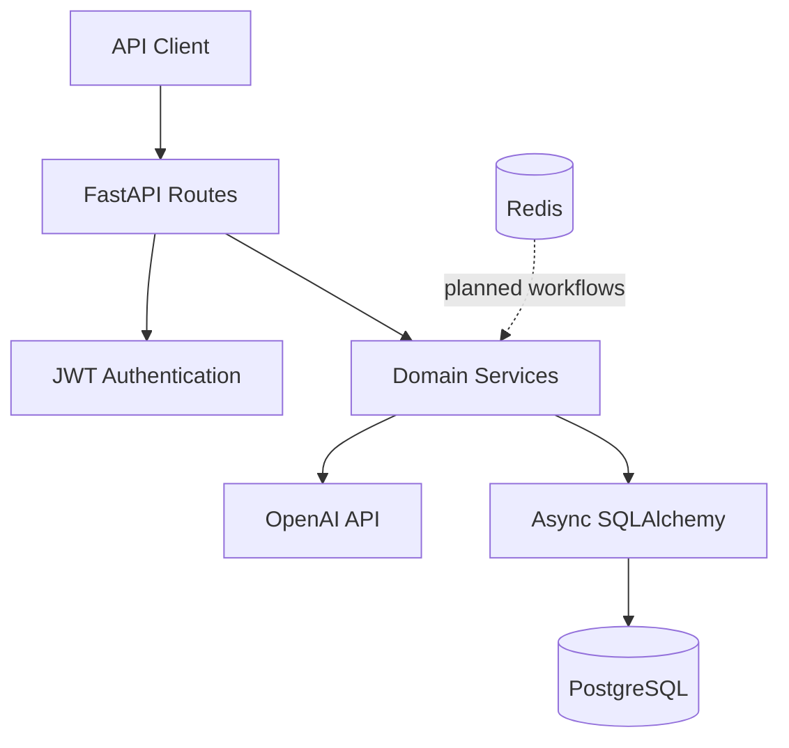
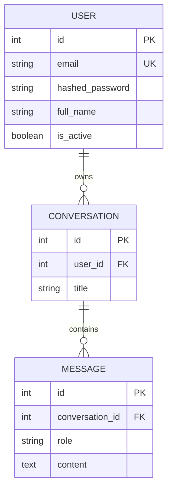
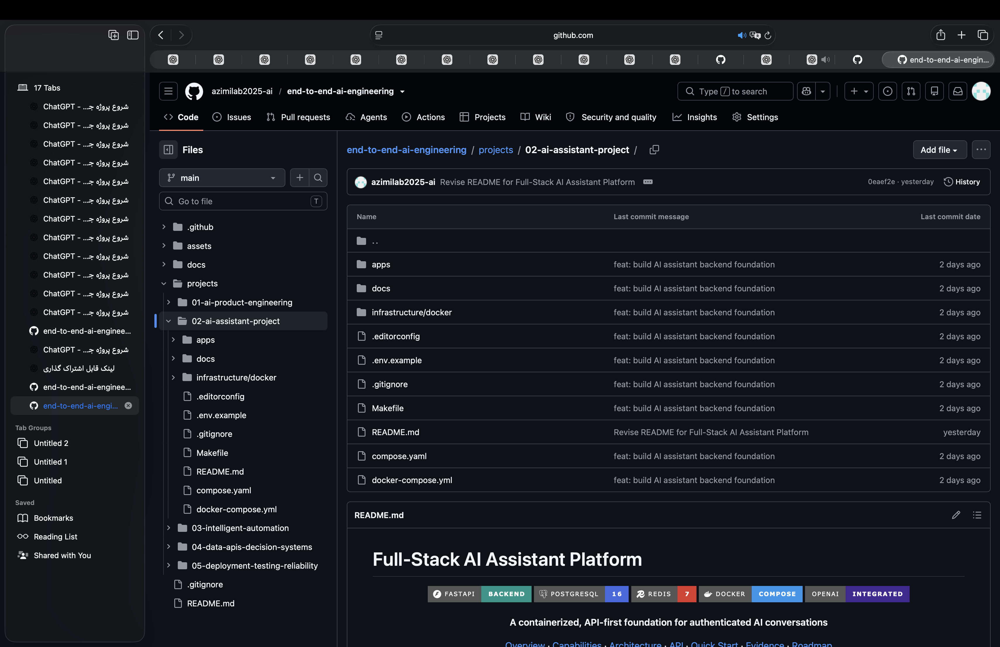
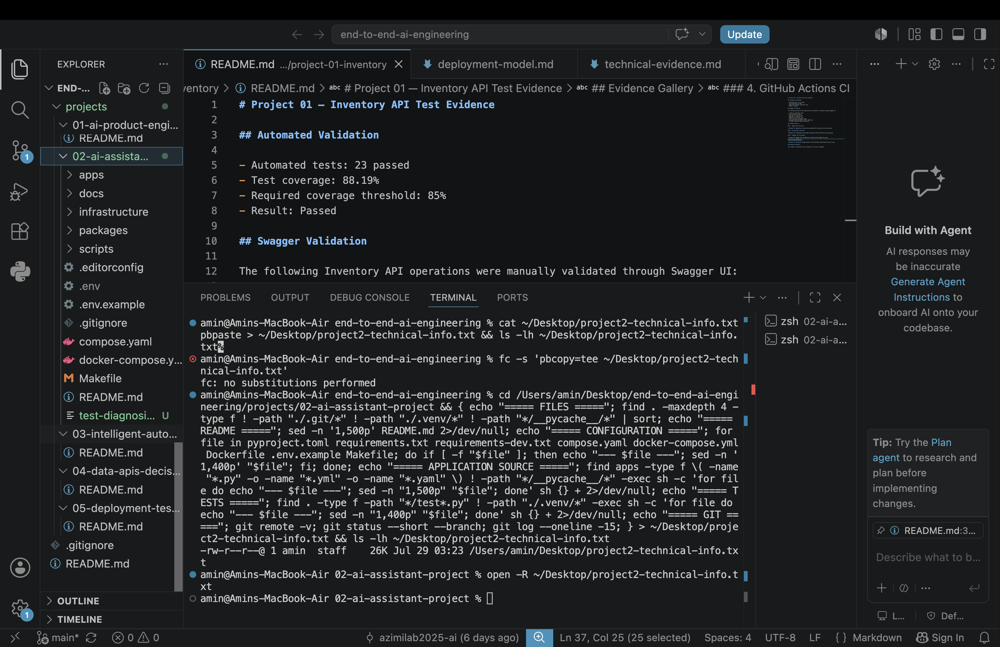
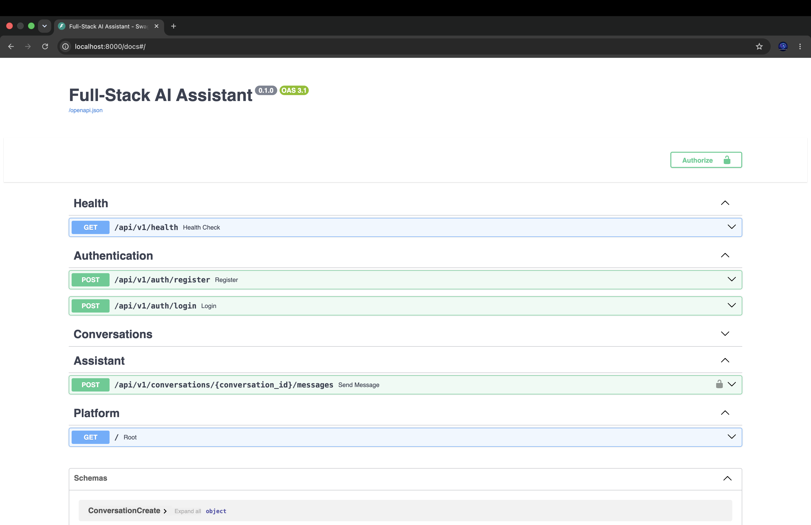

# Full-Stack AI Assistant Platform

<div align="center">

[](https://fastapi.tiangolo.com/)
[](https://www.postgresql.org/)
[](https://redis.io/)
[](https://www.docker.com/)
[](https://platform.openai.com/)

**A containerized, API-first foundation for authenticated AI conversations**

[Overview](#-overview) · [Capabilities](#-current-capabilities) · [Architecture](#️-architecture) · [API](#-api-surface) · [Quick Start](#-quick-start) · [Evidence](#-project-evidence) · [Roadmap](#️-roadmap)

</div>

---

## 🌟 Overview

Full-Stack AI Assistant Platform is a backend-focused portfolio project demonstrating how an AI capability can be engineered into a structured, authenticated, persistent, and containerized software system.

The current release establishes the core service layer for user registration and authentication, conversation management, message persistence, OpenAI-backed assistant replies, PostgreSQL storage, Redis infrastructure, automated health testing, and Docker-based local deployment.

> [!IMPORTANT]
> This repository is an actively developed engineering project. The backend foundation is implemented, while frontend, migration, observability, and production-hardening work remain in the roadmap.

## 🎯 Engineering Goals

- Build a clear separation between API, service, schema, model, database, and security layers.
- Scope conversations and messages to authenticated users.
- Persist conversational state in PostgreSQL.
- Integrate an external language model without exposing credentials in source control.
- Provide reproducible local infrastructure through Docker Compose.
- Document actual capabilities, limitations, and future work without overstating production readiness.

## 🚦 Current Capabilities

| Area | Status | Current scope |
|---|---:|---|
| Health endpoint | ✅ Implemented | Lightweight API health response |
| User registration | ✅ Implemented | Email-based account creation with password hashing |
| Authentication | ✅ Implemented | JWT bearer-token login and protected routes |
| Conversation lifecycle | ✅ Implemented | Create, list, retrieve, rename, and delete user-owned conversations |
| Message persistence | ✅ Implemented | Store user and assistant messages in chronological order |
| AI replies | ✅ Configurable | OpenAI response generation when `OPENAI_API_KEY` is configured |
| Database | ✅ Implemented | Async SQLAlchemy models backed by PostgreSQL |
| Redis | 🟡 Infrastructure ready | Container and persistence configured; application workflows are not yet connected |
| Automated tests | 🟡 Foundation | Health endpoint coverage is present; broader behavioral tests are planned |
| Frontend | 🔵 Planned | Current repository exposes an API-first backend |
| Production hardening | 🔵 Planned | Migrations, observability, rate limiting, and hardened token lifecycle remain future work |

## ✨ Functional Scope

### 🔐 Identity and Access

- Register users with validated email addresses.
- Hash passwords using `passlib` and bcrypt.
- Authenticate credentials and issue signed JWT access tokens.
- Reject invalid, inactive, or missing users on protected routes.
- Isolate conversation access by authenticated user.

### 💬 Conversations and Messages

- Create and list conversations.
- Retrieve a conversation with its ordered message history.
- Update conversation titles.
- Delete conversations and their dependent messages.
- Submit a user message and persist the generated assistant response.

### 🤖 AI Integration

- Build a chronological message history for each conversation.
- Apply a system instruction for concise, reliable, security-conscious behavior.
- Generate assistant replies through the asynchronous OpenAI client.
- Return an explicit configuration message when no API key is available.

### 🧱 Runtime and Infrastructure

- Run PostgreSQL 16 and Redis 7 as health-checked services.
- Build and run the FastAPI service in Docker.
- Persist PostgreSQL and Redis data with named volumes.
- Delay API startup until infrastructure health checks pass.
- Expose the API on port `8000`.

## 🏗️ Architecture



### Layer Responsibilities

| Layer | Location | Responsibility |
|---|---|---|
| Application | `apps/api/app/main.py` | FastAPI initialization and router registration |
| API | `apps/api/app/api/` | Endpoints, dependency injection, authentication guards, and HTTP responses |
| Schemas | `apps/api/app/schemas/` | Request validation and response serialization |
| Services | `apps/api/app/services/` | Authentication, conversation, message, and assistant workflows |
| Models | `apps/api/app/models/` | SQLAlchemy entities and relationships |
| Database | `apps/api/app/db/` | Async engine, sessions, base model, and lifecycle utilities |
| Core | `apps/api/app/core/` | Environment settings, password security, and JWT handling |
| Infrastructure | `compose.yaml` | PostgreSQL, Redis, API containers, health checks, and volumes |

## 🛠️ Technology Stack

| Category | Technology | Role |
|---|---|---|
| Language | Python | Application runtime |
| Web framework | FastAPI | Async API routing and validation |
| Data validation | Pydantic | Typed request, response, and environment settings |
| ORM | SQLAlchemy | Async relational persistence |
| Database | PostgreSQL 16 | Users, conversations, and messages |
| Cache infrastructure | Redis 7 | Prepared for future caching and background workflows |
| Authentication | JWT / `python-jose` | Bearer-token access |
| Password security | Passlib / bcrypt | Password hashing and verification |
| AI integration | OpenAI Python SDK | Assistant response generation |
| Testing | pytest / FastAPI TestClient | Automated API verification |
| Containers | Docker / Docker Compose | Reproducible local runtime |

## 🔌 API Surface

All versioned endpoints use the default prefix:

```text
/api/v1
```

### Platform

| Method | Endpoint | Authentication | Purpose |
|---|---|---:|---|
| `GET` | `/` | No | Return application name and runtime status |
| `GET` | `/api/v1/health` | No | Return API health information |

### Authentication

| Method | Endpoint | Authentication | Purpose |
|---|---|---:|---|
| `POST` | `/api/v1/auth/register` | No | Create a user account |
| `POST` | `/api/v1/auth/login` | No | Authenticate and return a bearer token |

### Conversations

| Method | Endpoint | Authentication | Purpose |
|---|---|---:|---|
| `GET` | `/api/v1/conversations` | Bearer | List the current user’s conversations |
| `POST` | `/api/v1/conversations` | Bearer | Create a conversation |
| `GET` | `/api/v1/conversations/{conversation_id}` | Bearer | Retrieve a conversation and its messages |
| `PATCH` | `/api/v1/conversations/{conversation_id}` | Bearer | Update a conversation title |
| `DELETE` | `/api/v1/conversations/{conversation_id}` | Bearer | Delete a conversation |
| `POST` | `/api/v1/conversations/{conversation_id}/messages` | Bearer | Store a user message and generate an assistant reply |

Interactive API documentation is available while the service is running:

- Swagger UI: `http://localhost:8000/docs`
- ReDoc: `http://localhost:8000/redoc`

## 🗃️ Data Model



All three entities include creation and update timestamps through a shared timestamp mixin.

## 📁 Project Structure

```text
.
├── apps/
│   ├── api/
│   │   ├── app/
│   │   │   ├── api/             # Routes and dependencies
│   │   │   ├── core/            # Configuration and security
│   │   │   ├── db/              # Async database setup
│   │   │   ├── models/          # SQLAlchemy entities
│   │   │   ├── schemas/         # Pydantic contracts
│   │   │   ├── services/        # Domain workflows
│   │   │   └── main.py          # FastAPI entry point
│   │   ├── tests/               # API tests
│   │   ├── Dockerfile
│   │   └── requirements.txt
│   └── web/                     # Reserved frontend workspace
├── docs/
│   ├── api/
│   ├── architecture/
│   └── security/
├── infrastructure/docker/
├── compose.yaml
├── Makefile
└── README.md
```

## 🚀 Quick Start

### Prerequisites

- Docker with Docker Compose, or
- Python with access to PostgreSQL for local execution

### 1. Clone the repository

```bash
git clone https://github.com/azimilab2025-ai/end-to-end-ai-engineering.git
cd end-to-end-ai-engineering
```

Navigate to this project directory if the repository contains multiple portfolio projects.

### 2. Configure the environment

```bash
cp .env.example .env
```

Set a long random JWT secret and add an OpenAI API key when AI responses are required:

```dotenv
JWT_SECRET_KEY=replace-with-a-long-random-secret
OPENAI_API_KEY=
```

> [!WARNING]
> Never commit `.env`, production secrets, private database URLs, or API keys.

### 3. Start the containerized stack

```bash
docker compose up --build -d
```

Or use:

```bash
make up
```

### 4. Verify the API

```bash
curl http://localhost:8000/api/v1/health
```

Expected response:

```json
{
  "status": "ok",
  "service": "ai-assistant-api"
}
```

Open Swagger UI at:

```text
http://localhost:8000/docs
```

### 5. Stop the stack

```bash
docker compose down
```

## 🧪 Local Development and Testing

Install API dependencies:

```bash
make install
```

Run the development server:

```bash
make run
```

Run tests:

```bash
make test
```

Run the compile check:

```bash
make check
```

View container logs:

```bash
make logs
```

## ⚙️ Environment Variables

| Variable | Required | Default / example | Purpose |
|---|---:|---|---|
| `APP_NAME` | No | `Full-Stack AI Assistant` | Display name for the service |
| `APP_ENV` | No | `development` | Runtime environment label |
| `APP_DEBUG` | No | `false` | FastAPI debug behavior |
| `API_V1_PREFIX` | No | `/api/v1` | Versioned API prefix |
| `DATABASE_URL` | Yes | PostgreSQL async URL | SQLAlchemy database connection |
| `REDIS_URL` | Future workflows | `redis://localhost:6379/0` | Redis connection |
| `JWT_SECRET_KEY` | Yes | Replace the example value | JWT signing secret |
| `JWT_ALGORITHM` | No | `HS256` | JWT signing algorithm |
| `ACCESS_TOKEN_EXPIRE_MINUTES` | No | `60` | Access-token lifetime |
| `OPENAI_API_KEY` | For AI replies | Empty | OpenAI authentication |

## 📸 Project Evidence

Exactly four screenshots are reserved for the final portfolio evidence. Add the files at the paths below without changing the count.

### 1. GitHub Repository



### 2. VS Code Implementation



### 3. Render Deployment


### 4. Docker and Swagger



## 🎥 Demo Video

The final walkthrough video will be linked here after publication:

<!-- Replace VIDEO_URL with the final YouTube or LinkedIn video URL. -->
[Watch the project demonstration](VIDEO_URL)

## 🔒 Security Notes

- Passwords are stored as hashes, not plaintext.
- Protected routes require a valid JWT bearer token.
- Conversation queries are scoped to the authenticated user.
- Secrets are loaded from environment variables.
- User-owned conversations return `404` when absent or inaccessible.

The current implementation still requires additional work before internet-scale production use:

- Replace example JWT secrets in every deployed environment.
- Add refresh-token rotation or revocable sessions.
- Apply rate limiting and abuse protection.
- Define and restrict CORS origins.
- Add structured audit and security logging.
- Introduce managed database migrations.
- Review message retention, deletion, and privacy requirements.

## ⚠️ Known Limitations

- The repository currently provides a backend foundation rather than a completed user-facing frontend.
- Redis is provisioned but not yet connected to application behavior.
- Database tables are defined in application models; a managed migration workflow is not yet established.
- The automated test suite currently demonstrates health-endpoint coverage and needs expansion across authentication, authorization, CRUD, AI failure handling, and database behavior.
- AI responses depend on an external API key, network availability, model access, and provider reliability.
- The configured model name and SDK call should be reviewed during dependency upgrades.
- Observability, background jobs, streaming responses, rate limiting, and deployment-specific hardening remain incomplete.

## 🗺️ Roadmap

### Phase 1 — Complete the Product Loop

- Build the responsive web client.
- Add registration, login, conversation, and message interfaces.
- Stream assistant responses.
- Expand integration tests for authentication and ownership boundaries.
- Introduce Alembic database migrations.

### Phase 2 — Reliability and Security

- Add refresh-token rotation and session revocation.
- Implement rate limits and explicit CORS policy.
- Add retry, timeout, and failure handling for external AI calls.
- Add structured logs, metrics, traces, and health/readiness separation.
- Connect Redis to caching, queues, or rate-limit state.

### Phase 3 — Intelligent Workflows

- Add retrieval-augmented generation.
- Support tool-based assistant actions with explicit confirmation.
- Add background processing and long-running jobs.
- Introduce model and prompt evaluation.
- Add cost, latency, and response-quality measurements.

## 📊 Completion Criteria

This project should be considered portfolio-complete when the following evidence is present:

- Source code and reproducible setup
- Automated tests for critical behavior
- Four final screenshots
- Published demonstration video
- Verified deployment evidence
- API and architecture documentation
- Security and limitation disclosures
- Measurable reliability or quality results

## 👨‍💻 Author

**Amin Azimi**  
**AI Architect & End-to-End Systems Engineer**  
**Azimi Innovation Lab**

---

<div align="center">

### Built to connect secure software engineering with practical AI systems.

</div>
